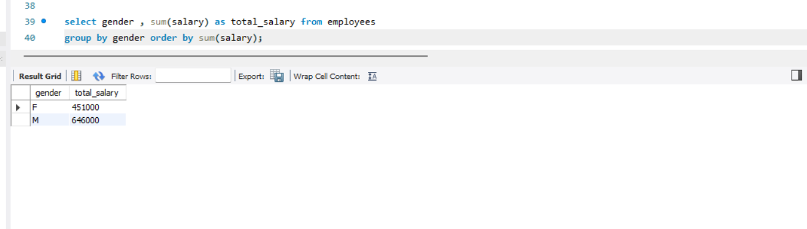
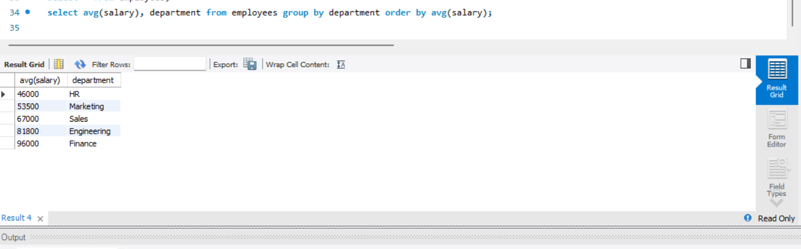
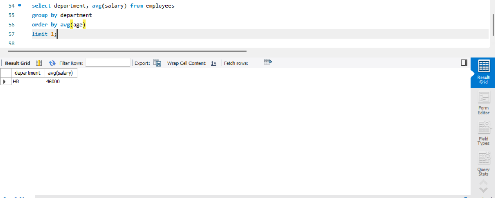
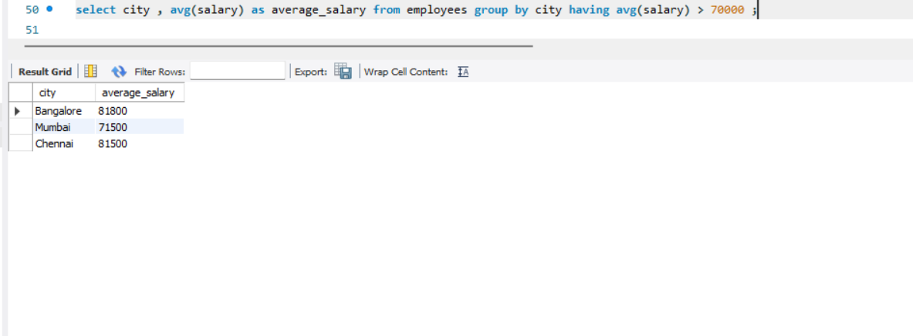
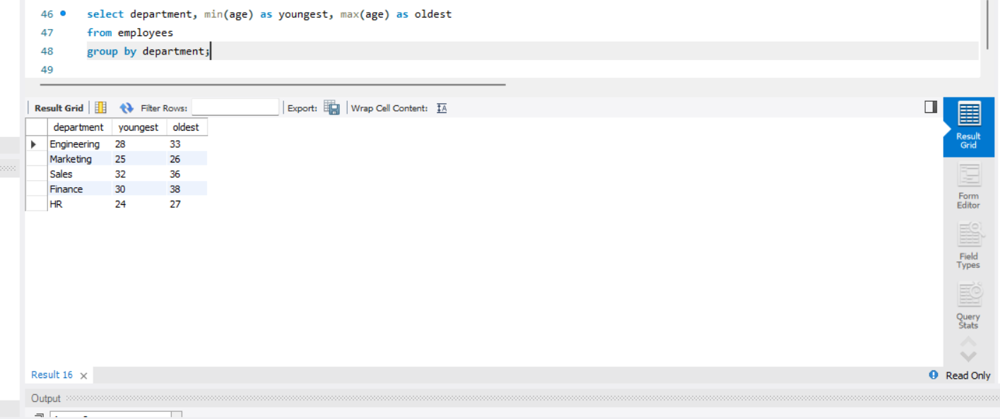
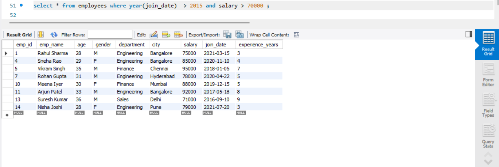
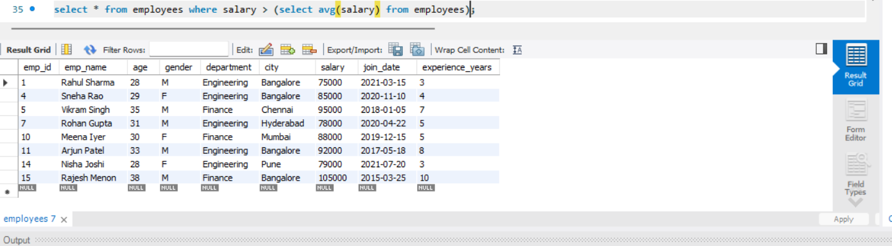

# SQL Employee Analysis

## 📊 Overview
This project analyzes employee data using SQL to extract insights related to salary, departments, and hiring trends.

## 🔍 Key Analysis Performed
- Average salary by department
- Top 5 highest paid employees
- Gender-wise salary comparison
- Employees above average salary
- Hiring trends by year
- Youngest and oldest employees per department

## 🛠 Tools Used
- MySQL Workbench
- SQL

## 📁 Project Structure
- employee_analysis.sql → All SQL queries
- screenshots/ → Output results

## 🚀 Author
Sarang

## 📸 Query Outputs & Insights

### 💰 Top 5 Highest Paid Employees

💡 Insight: Finance and Engineering roles dominate the highest salaries, indicating high-value positions.

---

### 👥 Gender-wise Salary Comparison

💡 Insight: Male employees contribute slightly higher total salary, but the gap is not very large.

---

### 📈 Department-wise Average Salary (Low → High)

💡 Insight: Finance has the highest average salary, while HR has the lowest.

---

### 🏆 Department with Highest Average Salary

💡 Insight: Finance department leads in salary, likely due to senior or specialized roles.

---

### 🎯 Departments with Avg Salary > 70000

💡 Insight: Only a few departments cross the 70K threshold, showing salary concentration.

---

### 👶👴 Youngest & Oldest Employees per Department

💡 Insight: Departments have a mix of junior and senior employees, indicating balanced experience.

---

### 📅 Hiring Trends by Year

💡 Insight: Hiring is consistent across years with slight growth in recent years.

---

### 🔍 Employees Joined After 2015 & Salary > 70000

💡 Insight: Many recent hires are entering higher salary brackets.

---

### 📊 Employees Earning Above Average Salary

💡 Insight: A smaller group earns above average, showing uneven salary distribution.

---

### 🏢 Total Number of Departments

💡 Insight: The company has 5 departments, indicating a structured organization.
